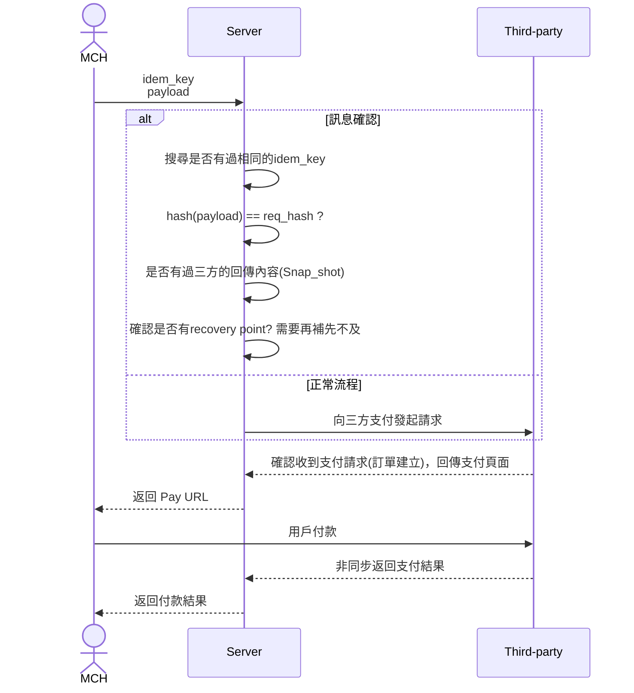

```mermaid
sequenceDiagram
actor  MCH
participant Server
participant Third-party
    MCH->>Server: idem_key<br/> payload
    alt 訊息確認
    Server->>Server: 搜尋是否有過相同的idem_key
    Server->>Server: hash(payload) == req_hash ?
    Server->>Server: 是否有過三方的回傳內容(Snap_shot)
    Server->>Server: 確認是否有recovery point? 需要再補先不及
    else 正常流程
    Server->>Third-party: 向三方支付發起請求
    end
    Third-party-->>Server: 確認收到支付請求(訂單建立)，回傳支付頁面
    Server-->>MCH: 返回 Pay URL
    MCH->>Third-party: 用戶付款
    Third-party-->>Server: 非同步返回支付結果
    Server-->>MCH: 返回付款結果
```
